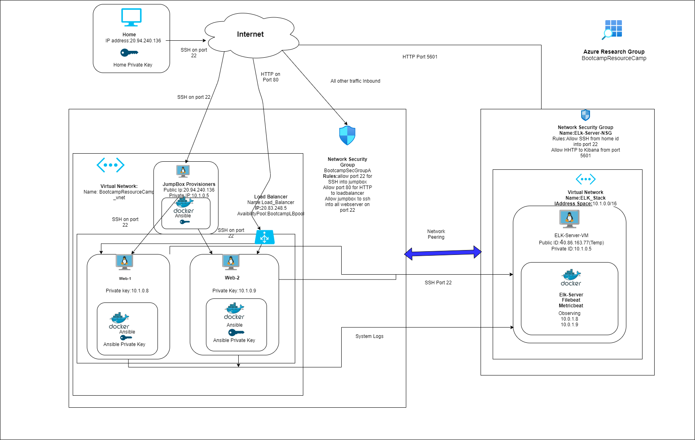
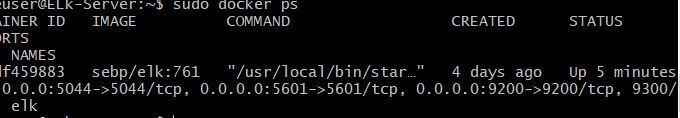

# GithubFUnda
Nutshell
## Automated ELK Stack Deployment

The files in this repository were used to configure the network depicted below.



These files have been tested and used to generate a live ELK deployment on Azure. They can be used to either recreate the entire deployment pictured above. Alternatively, select portions of the __yml___ file may be used to install only certain pieces of it, such as Filebeat.

  -: Enter the playbook file._---
  
  ```
- name: Installing and Launch Filebeat
  hosts: webservers
  become: yes
  tasks:
    # Use command module
  - name: Download filebeat .deb file
    command: curl -L -O https://artifacts.elastic.co/downloads/beats/filebeat/filebeat-7.6.1-amd64.deb

    # Use command module
  - name: Install filebeat .deb
    command: dpkg -i filebeat-7.6.1-amd64.deb

    # Use copy module
  - name: Drop in filebeat.yml
    copy:
      src: /etc/ansible/files/filebeat-config.yml
      dest: /etc/filebeat/filebeat.yml

    # Use command module
  - name: Enable and Configure System Module
    command: filebeat modules enable system

    # Use command module
  - name: Setup filebeat
    command: filebeat setup

    # Use command module
  - name: Start filebeat service
    command: service filebeat start

    # Use systemd module
  - name: Enable service filebeat on boot
    systemd:
      name: filebeat
      enabled: yes
      
```

This document contains the following details:
- Description of the Topology
- Access Policies
- ELK Configuration
  - Beats in Use
  - Machines Being Monitored
- How to Use the Ansible Build


### Description of the Topology

The main purpose of this network is to expose a load-balanced and monitored instance of DVWA, the D*mn Vulnerable Web Application.

Load balancing ensures that the application will be highly __available___, in addition to restricting __access___ to the network.
- What aspect of security do load balancers protect? What is the advantage of a jump box?_Load Balancer allows to redirect the traffic to the most available Container. Jump BOx protects from other users to log in and enables me to add yml files. 

Integrating an ELK server allows users to easily monitor the vulnerable VMs for changes to the __traffic___ and system __files___.
-  What does Filebeat watch for?_File Request locations and server responses
-  What does Metricbeat record?_VM performance and CPU, memory usage.

The configuration details of each machine may be found below.
_Note: Use the [Markdown Table Generator](http://www.tablesgenerator.com/markdown_tables) to add/remove values from the table_.

| Name     | Function | IP Address | Operating System |
|----------|----------|------------|------------------|
| Jump Box | Gateway  | 10.0.0.1 , 20.94.240.136   | Linux            |
| Web-1     |Container          |10.0.0.5            |Linux                  |
| Web-2    | Container         |         10.0.0.6   |Linux                  |
| Elk-Server   Monitor Traffic |10.1.0.5  , 40.86.163.77       |Linux            |                  |

### Access Policies

The machines on the internal network are not exposed to the public Internet. 

Only the __Jumpbox___ machine can accept connections from the Internet. Access to this machine is only allowed from the following IP addresses:
-  Add whitelisted IP addresses_103.217.166.23

Machines within the network can only be accessed by __Jumpbox___.
-: Which machine did you allow to access your ELK VM? What was its IP address?_ Jumpbox , 10.0.0.4

A summary of the access policies in place can be found in the table below.

| Name     | Publicly Accessible | Allowed IP Addresses |
|----------|---------------------|----------------------|
| Jump Box | Yes              |   103.217.166.23  |
| web-1         |No                     |   10.0.0.4                   |
| web-2         |  NO                   |   10.0.0.4           |
| Elk-Server     | Yes           |103.217.166.23 
### Elk Configuration

Ansible was used to automate configuration of the ELK machine. No configuration was performed manually, which is advantageous because...
- _TODO: What is the main advantage of automating configuration with Ansible?_The main advantage is that it allows to automate creation of containers with yml files.

The playbook implements the following tasks:
- : In 3-5 bullets, explain the steps of the ELK installation play. E.g., install Docker; download image; etc._
- ... - name: Install docker.io

- ... - name: Install python3-pip
- ...  - name: Install Docker module
- ...  - name: Increase virtual memory
- ...  - name: Use more memory
- ...  -name: vm.max_map_count
- ...  - name: download and launch a docker elk container
- ...  - name: Enable service docker on boot


The following screenshot displays the result of running `docker ps` after successfully configuring the ELK instance.



### Target Machines & Beats
This ELK server is configured to monitor the following machines:
-  List the IP addresses of the machines you are monitoring_Web-1 = 10.0.0.5, Web-2 = 10.0.0.6

We have installed the following Beats on these machines:
-  Specify which Beats you successfully installed_ Filebeat and Metricbeat.

These Beats allow us to collect the following information from each machine:
- : In 1-2 sentences, explain what kind of data each beat collects, and provide 1 example of what you expect to see. E.g., `Winlogbeat` collects Windows logs, which we use to track user logon events, etc._

Filebeat collects data form the requested file. for eg: the file path requested
Metricbeat collects data from the container usage i.e RAM memory, CPU etc. For eg: CPU Usage.

### Using the Playbook
In order to use the playbook, you will need to have an Ansible control node already configured. Assuming you have such a control node provisioned: 

SSH into the control node and follow the steps below:
- Copy the __Playbook___ file to _Jumpbox____.
- Update the __hosts___ file to include the VM IPs.
- Run the playbook, and navigate to __VM__ to check that the installation worked as expected.

_: Answer the following questions to fill in the blanks:_
- _Which file is the playbook? Where do you copy it?_
Elk-playbook.yml. We copy it into Jumpbox.
- _Which file do you update to make Ansible run the playbook on a specific machine? How do I specify which machine to install the ELK server on versus which to install Filebeat on?_
- We update the hosts file. We put Ip on the host file under ElK server. 
- _Which URL do you navigate to in order to check that the ELK server is running?
- http://[your.VM.IP]:5601/app/kibana.

_As a **Bonus**, provide the specific commands the user will need to run to download the playbook, update the files, etc._
ansbile-playbook filebeat.yml
ansible-playbook metricbeat.yml
ansible playbook deployrd.yml
